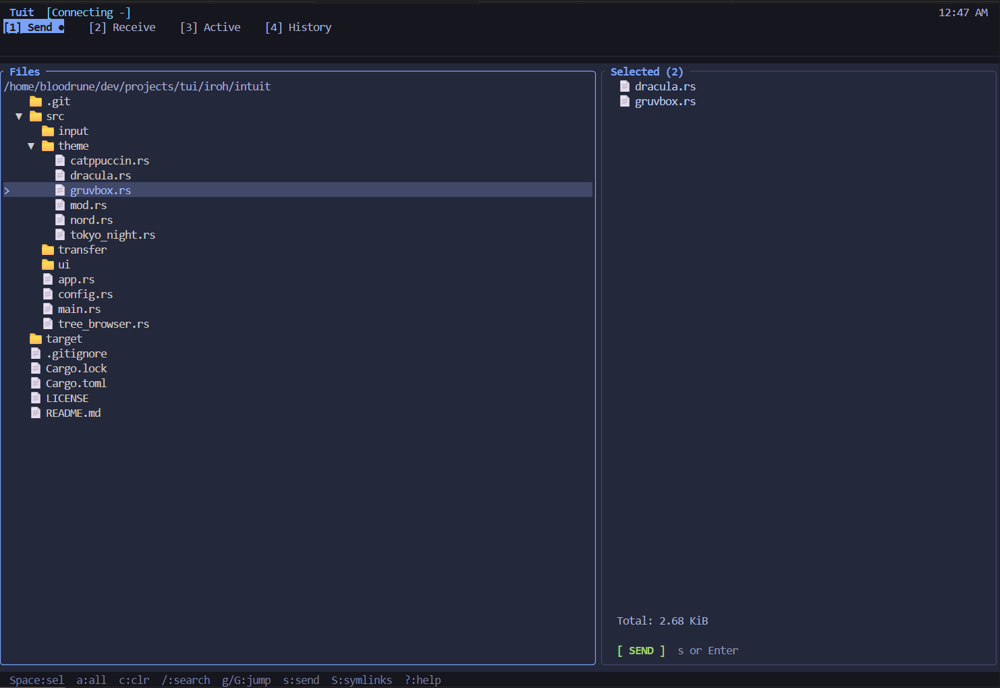
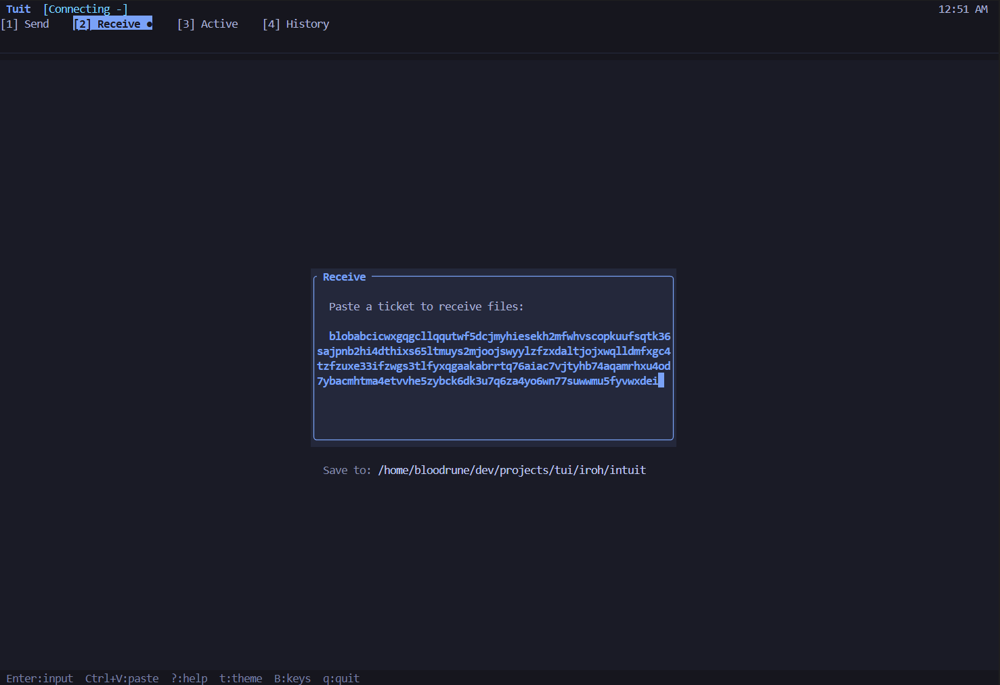
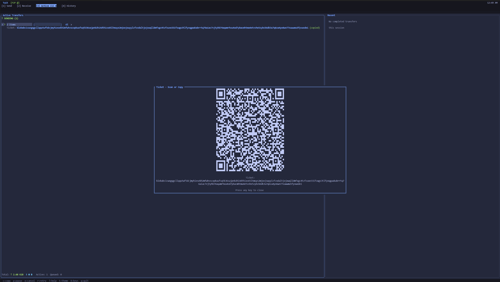

# Tuit

[](https://crates.io/crates/send-tuit)
[](https://crates.io/crates/send-tuit)
[](https://github.com/MrBloodrune/send-tuit/blob/main/LICENSE)
[](https://github.com/MrBloodrune/send-tuit/actions/workflows/ci.yml)

A minimal terminal UI for P2P file transfers via [iroh](https://iroh.computer/). Private, secure, and fully compatible with sendme CLI and AltSendme. E2E encryption and privacy with terminal simplicity — just send `tuit`.

<p align="center">
  
  
</p>
<p align="center">
  
  
</p>

## Features

| Feature | Description |
|---------|-------------|
| **No setup** | No accounts, no server config, no port forwarding |
| **Works anywhere** | Direct P2P when possible, automatic relay fallback |
| **QR code sharing** | Scan ticket with phone to transfer across devices |
| **SSH friendly** | Clipboard works over remote sessions (OSC52) |
| **Keyboard driven** | Vim/Emacs/Arrow key presets |
| **Fuzzy search** | `/` to search, results merge into navigable tree |
| **Tree navigation** | Expandable directory tree with lazy loading |
| **Conflict handling** | Rename, overwrite, or skip existing files |
| **Multi-file support** | Files or entire directories |
| **Progress tracking** | Real-time speed, ETA, connection type |
| **Themeable** | Dracula, Nord, Catppuccin, Tokyo Night, Gruvbox |

**Secure & private by design:**

| Feature | Description |
|---------|-------------|
| **QUIC + TLS 1.3** | Modern encrypted transport |
| **E2E encrypted** | Relays see nothing |
| **Content-addressed** | BLAKE3 hashing, tamper-proof |
| **Fresh NodeID** | No persistent identity per transfer |
| **Incognito mode** | No history, no config, clean exit |
| **Symlink protection** | Skipped by default (toggle: `S`) |
| **Path traversal protection** | Secure file handling |
| **No tracking** | No analytics, no accounts |

## Installation

### Cargo (recommended)

```bash
cargo install send-tuit
```

### Pre-built binaries

Download from [GitHub Releases](https://github.com/MrBloodrune/send-tuit/releases/latest) (Linux, macOS, Windows).

| Platform | Binary |
|----------|--------|
| Linux x86_64 | `tuit-*-x86_64-unknown-linux-gnu.tar.gz` |
| Linux x86_64 (static) | `tuit-*-x86_64-unknown-linux-musl.tar.gz` |
| Linux ARM64 | `tuit-*-aarch64-unknown-linux-gnu.tar.gz` |
| macOS Intel | `tuit-*-x86_64-apple-darwin.tar.gz` |
| macOS Apple Silicon | `tuit-*-aarch64-apple-darwin.tar.gz` |
| Windows | `tuit-*-x86_64-pc-windows-msvc.zip` |

### From source

```bash
git clone https://github.com/MrBloodrune/send-tuit
cd send-tuit
cargo build --release
cp target/release/tuit ~/.local/bin/
```

## Usage

Drop files in — no accounts, no cloud, just peer-to-peer.

```bash
tuit                    # normal mode
tuit --incognito        # no history, no config, clean exit
```

### CLI Options

| Flag | Description |
|------|-------------|
| `--incognito` | Private session: no history saved, no config loaded, data wiped on exit |
| `--config <path>` | Use custom config file instead of default |
| `--receive-dir <path>` | Override download directory |

### Sending files

1. Press `1` for Send tab
2. Navigate with `j`/`k` or arrows
3. `Space` to select files, `a` for all
4. `s` to send
5. Share the ticket (copied to clipboard, or press `c` to show QR code)

### Receiving files

1. Press `2` for Receive tab
2. Paste ticket (`Ctrl+V`)
3. Press `Enter` to start download

### Searching files

1. Press `/` to start search
2. Type to fuzzy match filenames
3. `j/k` or arrows to navigate results
4. `Space` to select, `Enter` to confirm view
5. `Esc` to cancel or clear results
6. Expand matched directories with `l` or `→`

### Keybindings

| Key | Action |
|-----|--------|
| `1-4` | Switch tabs |
| `j/k` or `↑/↓` | Navigate |
| `h/l` or `←/→` | Parent/Enter directory |
| `g/G` | Jump to first/last |
| `/` | Search files |
| `Space` | Toggle selection |
| `a` | Select all |
| `c` | Clear selection |
| `s` | Send selected |
| `S` | Toggle symlink following |
| `c` | Copy ticket / Show QR (Active tab) |
| `t` | Cycle theme |
| `B` | Change keybindings |
| `?` | Help |
| `q` | Quit |

## Compatibility

Tuit uses the standard `iroh_blobs::ticket::BlobTicket` format - the same ticket format used by the official sendme CLI and compatible GUI applications. Tickets are fully interchangeable.

### Compatible tools

- [sendme CLI](https://github.com/n0-computer/sendme) - Official iroh file transfer CLI
- [AltSendme](https://github.com/absalan/alt-sendme-file-transfer) - Desktop GUI (Windows/macOS/Linux)

### Cross-tool transfers

```bash
# Send from Tuit, receive with sendme CLI
sendme receive <ticket-from-tuit>

# Send with sendme CLI, receive in Tuit
sendme send ./file  # paste the ticket into Tuit's Receive tab

# Send from Tuit, receive with AltSendme
# Press 'c' to show QR code, scan with phone, paste ticket into AltSendme
```

### QR codes

Press `c` on an active send to display a QR code. The QR encodes the ticket text which can be:
- Scanned and copied to clipboard on your phone
- Pasted into sendme CLI or AltSendme on another device

## Configuration

Settings are stored in `~/.config/intuit/config.toml` and auto-saved when you change theme or keybindings.

```toml
[persistence]
history = true              # save transfer history

[preferences]
theme = "tokyo-night"       # catppuccin, dracula, nord, gruvbox, tokyo-night
key_preset = "vim"          # vim, arrows, emacs
receive_dir = "~/Downloads" # where to save received files

[transfer]
max_concurrent_sends = 50
max_concurrent_receives = 50
```

Use `--incognito` to skip config entirely for private sessions.

## Debug logging

```bash
RUST_LOG=debug tuit 2>debug.log
```

## License

MIT